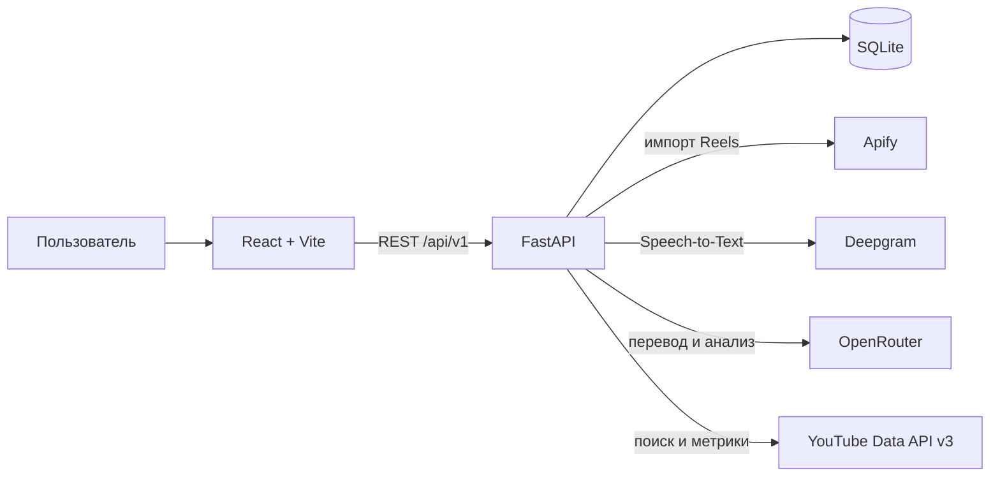

# Reels Finder

Reels Finder — локальная платформа для поиска контент-идей на основе Instagram Reels конкурентов и YouTube-видео. Сервис собирает ролики из внешних источников, помогает отобрать удачные примеры, расшифровать речь, выполнить AI-разбор и подготовить собственный сценарий.

Проект рассчитан на локальную однопользовательскую работу и запускается без Docker: backend работает на FastAPI и SQLite, frontend — на React и Vite.

## Содержание

- [Что умеет проект](#что-умеет-проект)
- [Основные сценарии работы](#основные-сценарии-работы)
- [Экраны приложения](#экраны-приложения)
- [Архитектура и технологии](#архитектура-и-технологии)
- [Структура репозитория](#структура-репозитория)
- [Локальный запуск](#локальный-запуск)
- [Настройка интеграций](#настройка-интеграций)
- [Переменные окружения](#переменные-окружения)
- [API](#api)
- [Данные и фоновые задачи](#данные-и-фоновые-задачи)
- [Проверки качества](#проверки-качества)
- [Безопасность](#безопасность)
- [Ограничения](#ограничения)
- [Дополнительная документация](#дополнительная-документация)

## Что умеет проект

### Instagram и конкуренты

- добавляет конкурента по `username`, `@username` или ссылке на Instagram-профиль;
- нормализует введённый адрес и защищает список от повторного добавления одного аккаунта;
- импортирует Reels через Apify в фоновой задаче;
- поддерживает два режима импорта:
  - `popular` — 5 роликов с максимальным количеством просмотров;
  - `latest` — 5 самых свежих роликов;
- показывает реальный прогресс импорта и позволяет повторить неудачную задачу;
- при повторном импорте обновляет метрики существующих роликов и не создаёт дубли;
- не перезаписывает пользовательские сценарии при обновлении данных из Apify;
- позволяет удалить конкурента вместе с его импортированными данными.

### Библиотека роликов

- объединяет импортированные Instagram Reels и сохранённые результаты YouTube-мониторинга;
- отображает обложку, автора, описание, дату публикации и метрики;
- поддерживает серверный поиск по описанию, автору и полям сценария;
- фильтрует Instagram Reels по конкуренту;
- сортирует по дате, просмотрам или лайкам;
- использует серверную пагинацию;
- хранит фильтры, сортировку и номер страницы в URL, поэтому состояние сохраняется после перезагрузки и при навигации назад/вперёд;
- позволяет взять ролик в работу или удалить неподходящий пример;
- проксирует Instagram-превью через backend, использует внешний image proxy и DNS-over-HTTPS fallback для окружений, где Meta CDN не разрешается системным DNS;
- проверяет источник медиа и ограничивает размер ответа, чтобы endpoint превью нельзя было использовать как произвольный прокси;
- показывает безопасный placeholder, только если все способы получения обложки недоступны.

### Работа со сценарием

- содержит редактор полей «Хук», «Основная часть», «CTA» и «Заметки»;
- поддерживает статусы `new`, `idea`, `script`, `ready`, `filmed`, `editing`, `published`, `archived`;
- автоматически сохраняет изменения с debounce 800 мс;
- не отправляет лишний запрос при первой загрузке формы;
- защищает новый ввод от перезаписи устаревшим ответом сервера;
- показывает состояния «Есть изменения», «Сохранение», «Сохранено» и ошибку сохранения;
- предупреждает о закрытии страницы при наличии несохранённых изменений;
- собирает все ролики со статусом, отличным от `new`, в разделе «Мои рилсы»;
- показывает контент-план из пяти этапов: «Доработка», «Готово», «Снято», «В монтаже», «Выложено»;
- позволяет перемещать карточки между этапами через drag-and-drop или доступный селект;
- экспортирует текущий контент-план в CSV.

### Расшифровка через Deepgram

- запускает распознавание речи вручную для выбранного Instagram Reel;
- выполняет задачу в фоне и показывает её статус через polling;
- сохраняет полный текст, язык, уверенность, слова, фразы и абзацы с таймкодами;
- позволяет скопировать расшифровку или вручную перенести её в основную часть сценария;
- запрашивает подтверждение перед заменой уже написанного текста;
- не смешивает описание публикации (`caption`) и распознанную речь (`transcript`);
- поддерживает повторный запуск после ошибки;
- распознаёт `REMOTE_CONTENT_ERROR` от Deepgram: если временная Instagram CDN-ссылка устарела, backend получает свежие `audioUrl`/`videoUrl` через Apify и автоматически повторяет транскрибацию.

### AI-анализ через OpenRouter

- работает с готовой расшифровкой Deepgram, а не с видео напрямую;
- определяет исходный язык и переводит текст на русский;
- выделяет тему, краткое содержание, хук, основную часть, заключение и CTA;
- формирует предложения для полей редактора сценария;
- вычисляет таймкоды на backend по индексам исходных фраз Deepgram;
- выполняется в фоне с polling статуса и возможностью повторного запуска;
- не перезаписывает редактор автоматически: пользователь сам выбирает применяемые блоки;
- сохраняет служебную информацию о модели и расходе токенов, но не хранит API-ключ и внутренние рассуждения модели.

### YouTube Monitoring

- использует официальный YouTube Data API v3;
- создаёт темы мониторинга с ключевыми и минус-словами;
- принимает канал в виде URL, `@handle`, Channel ID или ссылки на видео;
- поддерживает фильтры по формату (`all`, `shorts`, `videos`, `animation`), периоду публикации и минимальному числу просмотров;
- сортирует результаты по рейтингу, просмотрам, свежести или скорости роста;
- запускает проверку темы вручную в фоновой задаче и показывает этапы выполнения;
- собирает название, описание, канал, дату, длительность, просмотры, лайки и комментарии;
- рассчитывает скорость набора просмотров, engagement rate и итоговый score;
- дедуплицирует найденные видео и хранит снимки статистики;
- позволяет перенести найденное видео в общую библиотеку или удалить его;
- учитывает локальный дневной лимит квоты YouTube API.

### Обзор и интерфейс

- содержит публичный одностраничный лендинг на `/` с hero, возможностями, workflow, FAQ, тарифами и footer;
- использует GSAP ScrollTrigger, параллакс и адаптивные анимации с учётом `prefers-reduced-motion`;
- включает SEO metadata, Open Graph, JSON-LD и `robots.txt`;
- показывает реальные счётчики конкурентов, импортированных роликов, идей, сценариев, готовых материалов и активных задач;
- содержит быстрые переходы к основным пользовательским сценариям;
- показывает toast-уведомления и панель уведомлений для действий пользователя;
- имеет состояния загрузки, пустых результатов и ошибок;
- поддерживает клавиатурную навигацию, подписи полей, `aria-label`, focus-state и доступные диалоги;
- адаптирован для настольных и мобильных экранов.

> Экран `/ai-dashboard` — отдельный демонстрационный high-fidelity прототип на локальных мок-данных. Он не является основным рабочим интерфейсом и не сохраняет изменения в backend.

## Основные сценарии работы

### От Instagram Reel до собственного сценария

1. Откройте библиотеку и нажмите добавление конкурента либо перейдите на `/competitors`.
2. Укажите Instagram-аккаунт и выберите режим «Популярные» или «Последние 5».
3. Backend создаст конкурента, запустит Apify Actor и будет обновлять прогресс задачи.
4. После импорта ролики появятся в библиотеке без дублей.
5. Откройте ролик, оцените метрики и возьмите его в работу.
6. При необходимости запустите расшифровку речи через Deepgram.
7. После успешной расшифровки запустите AI-анализ через OpenRouter.
8. Выберите подходящие результаты анализа и примените их к редактору.
9. Доработайте хук, сценарий, CTA и заметки, затем выберите статус материала.
10. Ролик появится в «Моих рилсах» и сохранится при последующих импортах конкурента.

### Поиск идей на YouTube

1. Перейдите в `/youtube-monitoring`.
2. Создайте тему, задайте ключевые слова, исключения и фильтры.
3. Добавьте один или несколько каналов.
4. Нажмите «Проверить сейчас» и следите за прогрессом на карточке темы.
5. Отберите результаты по итоговому рейтингу и метрикам.
6. Перенесите интересные видео в общую библиотеку.

## Экраны приложения

| Маршрут | Назначение |
|---|---|
| `/` | Публичный SEO-лендинг Reels Finder |
| `/dashboard` | Обзор, реальные счётчики и быстрые действия |
| `/ideas` | Персональная лента идей и первичная обработка Reels |
| `/competitors` | Список конкурентов, импорт, прогресс задач, повтор и удаление |
| `/library` | Общая библиотека Instagram Reels и сохранённых YouTube-видео |
| `/reels` | Совместимый маршрут, перенаправляющий в ленту идей |
| `/reels/:reelId` | Карточка ролика, решение по ролику, расшифровка, AI-анализ и редактор |
| `/youtube-monitoring` | Темы, каналы, запуск мониторинга и найденные YouTube-видео |
| `/my-reels` | Канбан-контент-план с пятью производственными этапами и CSV-экспортом |
| `/ai-dashboard` | Демонстрационный UI-прототип на мок-данных |
| `*` | Страница 404 |

## Архитектура и технологии



### Backend

| Технология | Роль |
|---|---|
| Python 3.11+ | Язык backend; для разработки рекомендуется Python 3.12 |
| FastAPI + Uvicorn | REST API, OpenAPI и ASGI-сервер |
| Pydantic 2 | Валидация запросов, ответов и конфигурации |
| SQLAlchemy 2 | ORM и работа с данными |
| SQLite | Локальная база данных |
| Alembic | Версионирование схемы БД |
| httpx | Запросы к внешним API и тестирование |
| Pytest | Backend-тесты |
| Ruff + mypy | Линтинг и проверка типов |

Backend разделён на API-слой, сервисы бизнес-логики, репозитории, ORM-модели и схемы. HTTP-обработчики не обращаются к внешним провайдерам напрямую.

### Frontend

| Технология | Роль |
|---|---|
| React 18 + TypeScript | Интерфейс приложения |
| Vite 6 | Dev-server и production-сборка |
| React Router | Клиентские маршруты |
| TanStack Query | Кэш, мутации, polling и инвалидация данных |
| React Hook Form + Zod | Формы и клиентская валидация |
| Tailwind CSS + обычный CSS | Стили интерфейса |
| Vitest + Testing Library | Unit- и component-тесты |
| ESLint | Проверка frontend-кода |

### Основные сущности данных

| Сущность | Что хранит |
|---|---|
| `Competitor` | Instagram-профиль, статус импорта и число роликов |
| `ParsingJob` | режим, прогресс и результат задачи Apify |
| `Reel` | ссылки на медиа, описание, метрики и исходные данные импорта |
| `ReelContent` | пользовательский хук, сценарий, CTA, заметки и статус |
| `ReelTranscription` | результат Deepgram и временные метки |
| `ReelAnalysis` | перевод и структурный AI-разбор расшифровки |
| `MonitoringTopic` | тема YouTube-мониторинга и её фильтры |
| `MonitoredChannel` | подключённый YouTube-канал |
| `MonitoredVideo` | найденное видео, метрики, score и статус |
| `TopicVideo` | связь видео с темой мониторинга |
| `VideoStatisticsSnapshot` | история метрик YouTube-видео |
| `YouTubeQuotaLog` | оценка расхода квоты YouTube API |

## Структура репозитория

```text
fider/
├── apps/
│   ├── api/
│   │   ├── app/
│   │   │   ├── api/v1/          # HTTP endpoints
│   │   │   ├── core/            # конфигурация, ошибки, логирование
│   │   │   ├── database/        # engine, сессии и базовые классы
│   │   │   ├── models/          # SQLAlchemy-модели
│   │   │   ├── repositories/    # запросы к данным
│   │   │   ├── schemas/         # Pydantic-схемы
│   │   │   ├── services/        # бизнес-логика и внешние интеграции
│   │   │   └── tasks/           # фоновые задачи
│   │   ├── data/                # локальная SQLite-база
│   │   ├── migrations/          # Alembic-миграции
│   │   ├── scripts/             # служебные скрипты
│   │   └── tests/               # backend-тесты
│   └── web/
│       ├── public/               # статические ресурсы
│       └── src/
│           ├── api/              # типизированный API-клиент
│           ├── components/       # UI, формы, уведомления и layout
│           ├── features/         # отдельные функциональные экраны
│           ├── hooks/            # polling, autosave и служебные hooks
│           ├── pages/            # страницы приложения
│           ├── schemas/          # Zod-схемы
│           ├── types/            # TypeScript-типы
│           └── utils/            # форматирование и ошибки
├── docs/                          # документация по интеграциям
├── relseprod-frontend-dark/       # архивный дизайн-прототип, не используется приложением
└── README.md
```

## Локальный запуск

### Требования

- Python 3.11 или новее; рекомендуется Python 3.12;
- Node.js 20 или новее;
- npm;
- Git;
- учётные данные внешних сервисов нужны только для соответствующих интеграций.

Docker, PostgreSQL, Redis и отдельный worker для локального запуска не требуются.

### Windows PowerShell

Backend:

```powershell
cd apps/api
python -m venv .venv
.venv\Scripts\Activate.ps1
python -m pip install -e ".[dev]"
Copy-Item .env.example .env
python -m alembic upgrade head
python -m uvicorn app.main:app --reload --host 127.0.0.1 --port 8000
```

Frontend запускается во втором терминале:

```powershell
cd apps/web
npm install
Copy-Item .env.example .env
npm run dev -- --host 127.0.0.1 --port 4173
```

Если `.env` уже существует и содержит ключи, не копируйте `.env.example` поверх него.

### Linux и macOS

Backend:

```bash
cd apps/api
python3 -m venv .venv
source .venv/bin/activate
python -m pip install -e '.[dev]'
cp .env.example .env
python -m alembic upgrade head
python -m uvicorn app.main:app --reload --host 127.0.0.1 --port 8000
```

Frontend:

```bash
cd apps/web
npm install
cp .env.example .env
npm run dev -- --host 127.0.0.1 --port 4173
```

### Локальные адреса

| Сервис | URL |
|---|---|
| Frontend | <http://localhost:4173> или <http://127.0.0.1:4173> |
| Backend | <http://localhost:8000> |
| Swagger UI | <http://localhost:8000/docs> |
| ReDoc | <http://localhost:8000/redoc> |
| OpenAPI JSON | <http://localhost:8000/openapi.json> |
| Healthcheck | <http://localhost:8000/health> |

Успешный healthcheck возвращает:

```json
{"status":"ok","database":"connected"}
```

## Настройка интеграций

Все ключи хранятся только в `apps/api/.env`. Их нельзя помещать в `apps/web/.env` или в переменные с префиксом `VITE_`, потому что такие значения доступны браузеру.

### Apify

Apify отвечает за загрузку Instagram Reels. Создайте API token в Apify Console и добавьте:

```ini
APIFY_API_TOKEN=<ваш_токен>
APIFY_ACTOR_ID=apify/instagram-reel-scraper
APIFY_ACTOR_INPUT_STYLE=auto
```

Без настройки Apify приложение и остальные функции запускаются, но импорт вернёт `APIFY_NOT_CONFIGURED`. Каждый запуск Actor может расходовать кредиты аккаунта.

### Deepgram

Deepgram нужен только для распознавания речи:

```ini
DEEPGRAM_API_KEY=<ваш_ключ>
DEEPGRAM_MODEL=nova-3
DEEPGRAM_LANGUAGE=multi
```

Без ключа запуск расшифровки вернёт `DEEPGRAM_NOT_CONFIGURED`. При ответе Deepgram `REMOTE_CONTENT_ERROR` backend автоматически обновляет временную ссылку на медиа через `apify/instagram-scraper` и повторяет распознавание. Для этого одновременно должны быть настроены Deepgram и Apify.

### OpenRouter

OpenRouter обрабатывает уже готовую расшифровку:

```ini
OPENROUTER_API_KEY=<ваш_ключ>
OPENROUTER_MODEL=openai/gpt-oss-120b:free
```

По умолчанию указана бесплатная модель без автоматического перехода на платную. Бесплатные модели могут иметь ограничения частоты запросов и временно быть недоступны.

### YouTube Data API v3

1. Создайте проект в Google Cloud Console.
2. Включите YouTube Data API v3.
3. Создайте API key и ограничьте его использованием YouTube Data API.
4. Добавьте ключ в backend-конфигурацию:

```ini
YOUTUBE_API_KEY=<ваш_ключ>
YOUTUBE_DAILY_QUOTA_LIMIT=9000
YOUTUBE_MONITORING_ENABLED=true
```

После изменения миграций или первого включения мониторинга выполните `python -m alembic upgrade head`.

## Переменные окружения

### Backend: `apps/api/.env`

Полный шаблон находится в [`apps/api/.env.example`](apps/api/.env.example).

| Переменная | Значение по умолчанию | Назначение |
|---|---|---|
| `APP_ENV` | `development` | Режим `development`, `testing` или `production` |
| `APP_HOST` | `127.0.0.1` | Адрес backend |
| `APP_PORT` | `8000` | Порт backend |
| `DATABASE_URL` | `sqlite:///./data/relseprod.db` | Строка подключения к БД |
| `CORS_ORIGINS` | `http://localhost:4173,http://127.0.0.1:4173` | Разрешённые frontend origins через запятую |
| `LOG_LEVEL` | `INFO` | Уровень логирования |
| `APIFY_API_TOKEN` | пусто | Секретный токен Apify |
| `APIFY_ACTOR_ID` | пусто | Actor в формате `owner/actor-name` |
| `APIFY_ACTOR_INPUT_STYLE` | `auto` | `auto`, `username` или `direct_urls` |
| `APIFY_RESULTS_LIMIT` | `20` | Размер пула кандидатов перед выбором пяти роликов |
| `APIFY_TIMEOUT_SECONDS` | `300` | Таймаут запуска Actor |
| `APIFY_POLL_INTERVAL_SECONDS` | `3` | Интервал опроса Actor |
| `DEEPGRAM_API_KEY` | пусто | Секретный ключ Deepgram |
| `DEEPGRAM_BASE_URL` | `https://api.deepgram.com/v1` | Адрес Deepgram API |
| `DEEPGRAM_MODEL` | `nova-3` | Модель распознавания |
| `DEEPGRAM_LANGUAGE` | `multi` | Язык или мультиязычное распознавание |
| `DEEPGRAM_TIMEOUT_SECONDS` | `180` | Таймаут расшифровки |
| `DEEPGRAM_SMART_FORMAT` | `true` | Форматирование текста |
| `DEEPGRAM_UTTERANCES` | `true` | Выделение фраз |
| `DEEPGRAM_PARAGRAPHS` | `true` | Выделение абзацев |
| `DEEPGRAM_NUMERALS` | `true` | Нормализация чисел |
| `DEEPGRAM_PUNCTUATE` | `true` | Пунктуация |
| `OPENROUTER_API_KEY` | пусто | Секретный ключ OpenRouter |
| `OPENROUTER_BASE_URL` | `https://openrouter.ai/api/v1` | Адрес OpenRouter API |
| `OPENROUTER_MODEL` | `openai/gpt-oss-120b:free` | Используемая LLM |
| `OPENROUTER_TIMEOUT_SECONDS` | `180` | Таймаут запроса |
| `OPENROUTER_TEMPERATURE` | `0.1` | Температура модели |
| `OPENROUTER_MAX_OUTPUT_TOKENS` | `4096` | Максимум выходных токенов |
| `OPENROUTER_REASONING_EFFORT` | `low` | Уровень reasoning |
| `OPENROUTER_RESPONSE_HEALING` | `true` | Исправление структурированного ответа провайдером |
| `OPENROUTER_HTTP_REFERER` | пусто | Необязательный referer приложения |
| `OPENROUTER_APP_TITLE` | `Reels Finder` | Название клиента для OpenRouter |
| `OPENROUTER_INVALID_RESPONSE_RETRIES` | `1` | Повтор при некорректном JSON-ответе |
| `YOUTUBE_API_KEY` | пусто | Секретный ключ YouTube Data API |
| `YOUTUBE_DAILY_QUOTA_LIMIT` | `9000` | Локальный дневной предел квоты |
| `YOUTUBE_MONITORING_ENABLED` | `true` | Включение мониторинга |

### Frontend: `apps/web/.env`

```ini
VITE_API_URL=http://localhost:8000/api/v1
```

Во frontend-конфигурации нет и не должно быть секретов.

## API

Все прикладные endpoints имеют префикс `/api/v1`. Актуальный интерактивный контракт всегда доступен в Swagger по адресу <http://localhost:8000/docs>.

### Системные endpoints

| Метод | Путь | Назначение |
|---|---|---|
| `GET` | `/` | Информация о сервисе |
| `GET` | `/health` | Проверка API и подключения к БД |
| `GET` | `/api/v1/health` | Healthcheck под API-префиксом |
| `GET` | `/api/v1/info` | Версия и информация о сервисе |

### Конкуренты и импорт

| Метод | Путь | Назначение |
|---|---|---|
| `GET` | `/api/v1/competitors` | Получить список конкурентов |
| `POST` | `/api/v1/competitors` | Добавить Instagram-профиль |
| `GET` | `/api/v1/competitors/{id}` | Получить конкурента |
| `DELETE` | `/api/v1/competitors/{id}` | Удалить конкурента и связанные данные |
| `POST` | `/api/v1/competitors/{id}/parse` | Запустить импорт в режиме `popular` или `latest` |
| `GET` | `/api/v1/jobs/{id}` | Получить статус и прогресс импорта |
| `POST` | `/api/v1/jobs/{id}/retry` | Повторить завершившуюся ошибкой задачу |

### Библиотека и сценарии

| Метод | Путь | Назначение |
|---|---|---|
| `GET` | `/api/v1/reels` | Библиотека с поиском, фильтром, сортировкой и пагинацией |
| `GET` | `/api/v1/reels/my` | Ролики, взятые в работу |
| `GET` | `/api/v1/reels/{id}` | Полная карточка ролика |
| `GET` | `/api/v1/reels/{id}/thumbnail` | Проксированное превью Instagram |
| `POST` | `/api/v1/reels/{id}/take-to-work` | Перенести ролик в «Мои рилсы» |
| `PUT` | `/api/v1/reels/{id}/content` | Сохранить сценарий и статус |
| `DELETE` | `/api/v1/reels/{id}` | Удалить неподходящий ролик |
| `GET` | `/api/v1/dashboard/summary` | Получить реальные счётчики обзора |

Параметры `GET /reels`: `competitor_id`, `search`, `sort=date|views|likes`, `page`, `limit`. Максимальный `limit` — 100, интерфейс использует страницы по 20 элементов.

### Расшифровка и AI-анализ

| Метод | Путь | Назначение |
|---|---|---|
| `GET` | `/api/v1/reels/{id}/transcription` | Статус и результат расшифровки |
| `POST` | `/api/v1/reels/{id}/transcription` | Запустить Deepgram-задачу |
| `POST` | `/api/v1/reels/{id}/transcription/retry` | Повторить расшифровку после ошибки |
| `GET` | `/api/v1/reels/{id}/analysis` | Статус и результат AI-анализа |
| `POST` | `/api/v1/reels/{id}/analysis` | Запустить анализ готовой расшифровки |
| `POST` | `/api/v1/reels/{id}/analysis/retry` | Повторить анализ после ошибки |

### YouTube Monitoring

| Метод | Путь | Назначение |
|---|---|---|
| `GET/POST` | `/api/v1/monitoring/topics` | Список и создание тем |
| `PATCH/DELETE` | `/api/v1/monitoring/topics/{id}` | Изменение и удаление темы |
| `POST` | `/api/v1/monitoring/topics/{id}/run` | Ручной запуск проверки |
| `GET/POST` | `/api/v1/monitoring/channels` | Список и добавление каналов |
| `DELETE` | `/api/v1/monitoring/channels/{id}` | Удаление канала |
| `GET` | `/api/v1/monitoring/videos` | Найденные или сохранённые видео |
| `GET` | `/api/v1/monitoring/videos/{id}` | Карточка видео |
| `PATCH` | `/api/v1/monitoring/videos/{id}/status` | Изменение статуса |
| `POST` | `/api/v1/monitoring/videos/{id}/library` | Перенос в общую библиотеку |
| `POST` | `/api/v1/monitoring/videos/{id}/required` | Пометить обязательным |
| `POST` | `/api/v1/monitoring/videos/{id}/ignore` | Игнорировать видео |
| `DELETE` | `/api/v1/monitoring/videos/{id}` | Удалить видео |

### Формат ошибок

Backend возвращает единый JSON-конверт:

```json
{
  "error": {
    "code": "COMPETITOR_ALREADY_EXISTS",
    "message": "Конкурент уже добавлен",
    "details": {}
  }
}
```

Frontend преобразует HTTP-, сетевые и timeout-ошибки в единый тип и показывает понятное сообщение пользователю.

## Данные и фоновые задачи

### База данных и миграции

По умолчанию SQLite-файл находится в `apps/api/data/relseprod.db`. Схема создаётся и обновляется только через Alembic:

```powershell
cd apps/api
.venv\Scripts\python.exe -m alembic upgrade head
```

Создать новую миграцию после изменения моделей:

```powershell
.venv\Scripts\python.exe -m alembic revision --autogenerate -m "описание изменения"
```

Повторный Instagram-импорт использует стабильные внешние идентификаторы и обновляет существующие записи. Пользовательский `ReelContent`, расшифровка и анализ отделены от сырых данных импорта.

### Фоновые задачи

Импорт Apify, Deepgram-транскрибация, OpenRouter-анализ и ручной запуск YouTube-мониторинга выполняются через фоновые задачи FastAPI в процессе backend. HTTP-запрос запуска возвращается сразу, а frontend опрашивает статус.

Для production это необходимо заменить отдельной очередью и worker-процессом. В текущей реализации перезапуск backend прерывает выполняющуюся работу, а незавершённая запись может остаться в активном статусе.

### Кэш frontend

TanStack Query использует централизованные query keys. После добавления конкурента, импорта, сохранения сценария и других мутаций инвалидируются только связанные данные. Устаревшие запросы отменяются через `AbortSignal`; API-клиент использует таймаут 20 секунд.

## Проверки качества

### Backend

```powershell
cd apps/api
.venv\Scripts\python.exe -m ruff check .
.venv\Scripts\python.exe -m pytest
.venv\Scripts\python.exe -m alembic upgrade head
```

Backend-тесты покрывают конфигурацию, модели, API, импорт и дедупликацию Reels, Apify, Deepgram, OpenRouter и YouTube Monitoring.

### Frontend

```powershell
cd apps/web
npm run lint
npm run typecheck
npm run test
npm run build
```

Frontend-тесты проверяют API-клиент, формы конкурентов, импорт и polling, библиотеку, поиск, пагинацию, карточку ролика, медиа-fallback, расшифровку, редактор и защиту автосохранения от гонок.

### Короткий smoke-тест

1. Откройте <http://localhost:4173> и убедитесь, что обзор загрузился без сетевой ошибки.
2. Добавьте конкурента и дождитесь завершения импорта.
3. Проверьте поиск, фильтр и сортировку в библиотеке.
4. Возьмите ролик в работу, измените сценарий и обновите страницу.
5. При наличии ключей запустите Deepgram, затем OpenRouter.
6. Создайте YouTube-тему, добавьте канал и выполните проверку.
7. Перенесите YouTube-видео в библиотеку.
8. Проверьте <http://localhost:8000/health> и Swagger.

## Безопасность

- реальные `.env` исключены из Git;
- секреты используются только backend и не попадают в browser bundle;
- заголовки авторизации внешних провайдеров не логируются;
- входные данные проходят Pydantic- и Zod-валидацию;
- исходная расшифровка передаётся LLM как недоверенный текст, а структурированный ответ проверяется по JSON Schema;
- пользовательские данные React отображает как текст, `dangerouslySetInnerHTML` не используется;
- внешние ссылки открываются с `noopener noreferrer`;
- удаление конкурента требует подтверждения в интерфейсе.

Если секрет попал в чат, лог, коммит или скриншот, немедленно отзовите его в кабинете провайдера и создайте новый.

## Ограничения

- это локальный MVP без регистрации, авторизации, ролей, оплаты и полноценной изоляции пользователей;
- рабочая БД — SQLite; production-конфигурация PostgreSQL не подготовлена;
- фоновые задачи выполняются внутри процесса FastAPI, без Redis, очереди и отдельного worker;
- автоматическое расписание YouTube-проверок не встроено: для production нужен внешний cron и distributed lock;
- Instagram-видео и обложки не хранятся постоянно на диске; backend умеет проксировать превью и восстанавливать media URL для транскрибации, но работа всё равно зависит от доступности Apify, Deepgram, Google DNS-over-HTTPS и Instagram CDN;
- импорт и AI-функции зависят от доступности, лимитов, стоимости и квот внешних провайдеров;
- определение YouTube Shorts и анимации частично основано на эвристиках;
- публикация в Instagram/YouTube, календарь контента, совместная работа и аналитические отчёты не реализованы;
- уведомления интерфейса локальные и не отправляются в Telegram, email или push-каналы;
- блок «Последняя активность» на обзорном экране содержит демонстрационные записи, хотя верхние счётчики загружаются из БД;
- `/ai-dashboard` работает на мок-данных и не входит в основной backend-сценарий.

## Troubleshooting

### Backend не запускается

Убедитесь, что активировано окружение, установлены зависимости и применены миграции:

```powershell
cd apps/api
.venv\Scripts\Activate.ps1
python -m pip install -e ".[dev]"
python -m alembic upgrade head
python -m uvicorn app.main:app --reload --port 8000
```

### Frontend показывает сетевую ошибку

Проверьте, что backend отвечает на <http://localhost:8000/health>, а `VITE_API_URL` равен `http://localhost:8000/api/v1`. После изменения `.env` перезапустите Vite.

### PowerShell запрещает активацию venv

Можно не менять Execution Policy и вызывать инструменты напрямую:

```powershell
apps\api\.venv\Scripts\python.exe -m uvicorn app.main:app --port 8000
```

### Порт уже занят

Найдите процесс, который слушает порт:

```powershell
Get-NetTCPConnection -LocalPort 8000,4173 -State Listen
```

Либо запустите сервис на другом порту и синхронно обновите `VITE_API_URL` и `CORS_ORIGINS`.

## Дополнительная документация

- [`apps/api/README.md`](apps/api/README.md) — детальная документация backend, моделей, миграций и ошибок;
- [`apps/web/README.md`](apps/web/README.md) — frontend, кэш, polling, автосохранение, доступность и тесты;
- [`docs/apify-integration.md`](docs/apify-integration.md) — вход и выход Actor, нормализация и дедупликация;
- [`docs/deepgram-integration.md`](docs/deepgram-integration.md) — Speech-to-Text, модель данных и пользовательский сценарий;
- [`docs/openrouter-analysis-integration.md`](docs/openrouter-analysis-integration.md) — перевод, структурный анализ и защита данных;
- [`docs/youtube-monitoring.md`](docs/youtube-monitoring.md) — Google Cloud, квота, cron и ограничения мониторинга.
